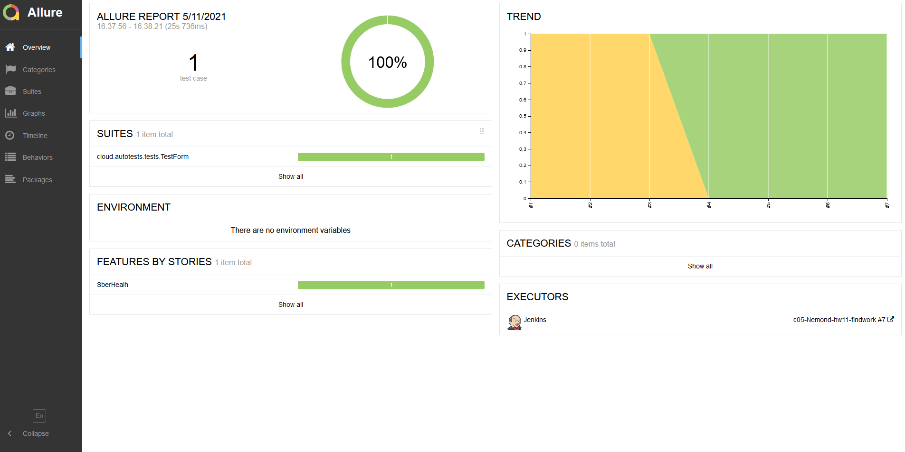
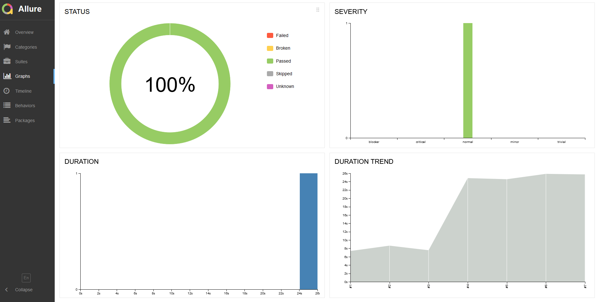
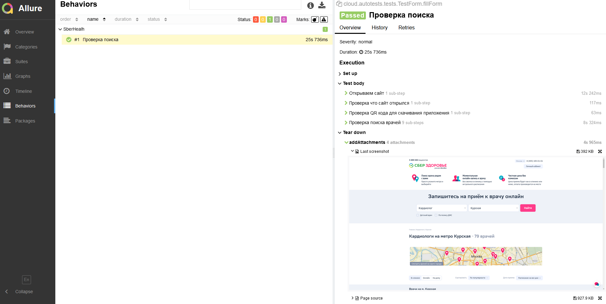
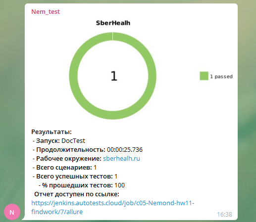

# Пример тестирования сайта с отправкой результатов тестирования в телеграмм-чат
https://sberhealh.ru

# Используемые технологии:

### отчет Allure report

### Видео теста 

### ссылка на проект в Jenkins
https://jenkins.autotests.cloud/job/c05-Nemond-hw11-findwork/

### сообщение отправленное в Telegram
